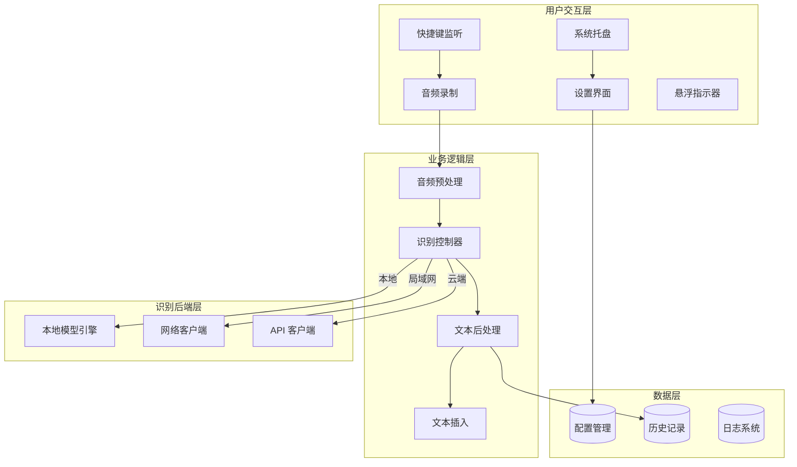
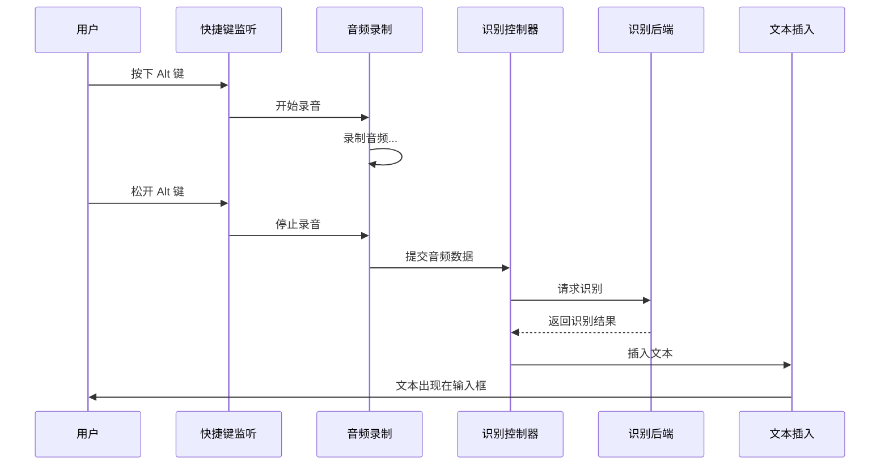
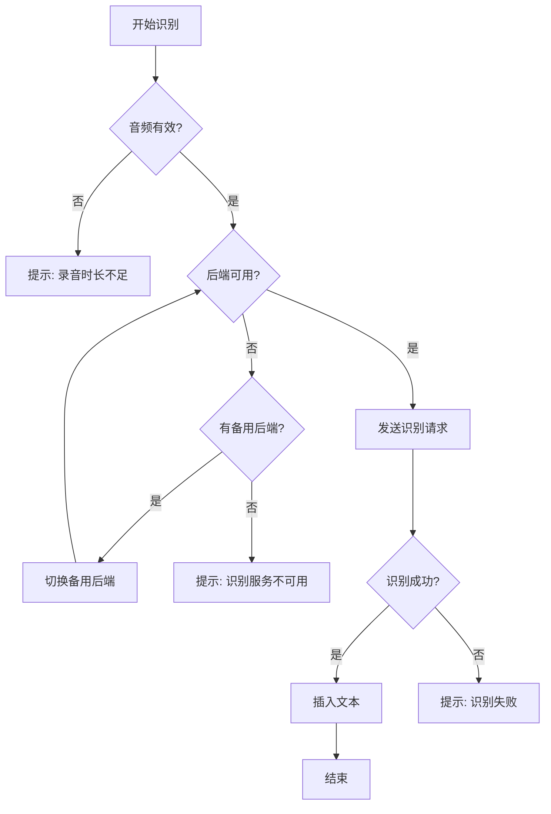

# JustSay - 语音转录工具 PRD

> **版本**: 1.1  
> **日期**: 2025-12-18  
> **状态**: 已确认

---

## 1. 产品概述

### 1.1 产品名称

**JustSay** - 智能语音转录工具

### 1.2 产品定位

一款轻量级、跨平台的语音转录工具，通过快捷键触发录音，实时将语音转换为文字并自动插入到当前活动的输入框中。

### 1.3 目标用户

- 需要大量文字输入的办公人员
- 编程开发者（编写注释、文档）
- 内容创作者
- 有无障碍需求的用户
- 多语言工作者

### 1.4 核心价值

- **快速输入**：语音输入比打字更快
- **解放双手**：减少键盘使用疲劳
- **无缝集成**：在任何应用程序中使用
- **灵活部署**：支持本地、局域网、云端多种识别方案

---

## 2. 功能需求

### 2.1 核心功能

#### 2.1.1 快捷键触发 (P0)

| 需求项       | 描述                                   |
| ------------ | -------------------------------------- |
| 默认快捷键   | 右侧 Alt 键（Right Alt）               |
| 触发方式     | **按住说话，松开识别**（Push-to-Talk） |
| 自定义快捷键 | 用户可在设置中修改为其他按键或组合键   |
| 视觉反馈     | 录音时显示悬浮指示器（波形/图标）      |
| 音频反馈     | 可选：开始/结束录音时的提示音          |

#### 2.1.2 语音录制 (P0)

| 需求项   | 描述                              |
| -------- | --------------------------------- |
| 音频格式 | WAV / PCM（16kHz, 16bit, 单声道） |
| 最短录制 | 0.5 秒（过短不处理）              |
| 最长录制 | 可配置，默认 60 秒                |
| 音频缓存 | 临时存储，识别完成后删除          |
| 降噪处理 | 可选：基础降噪预处理              |

#### 2.1.3 语音识别 (P0)

| 需求项     | 描述                        |
| ---------- | --------------------------- |
| 多语言支持 | 中文、英文、日文等常见语言  |
| 自动检测   | 可选：自动识别语言          |
| 手动指定   | 用户可锁定特定语言          |
| 标点智能   | 自动添加标点符号            |
| 热词支持   | 可选：自定义热词/专业术语表 |

#### 2.1.4 文本插入 (P0)

| 需求项     | 描述                           |
| ---------- | ------------------------------ |
| 插入方式   | 模拟键盘输入（兼容性最佳）     |
| 焦点保持   | 录音期间保持原输入框焦点       |
| 剪贴板模式 | 可选：复制到剪贴板而非直接输入 |
| 追加模式   | 连续语音输入时自动添加空格     |

### 2.2 识别后端支持 (P0)

> [!IMPORTANT]
> 系统需支持三种识别模式，用户可自由切换

#### 2.2.1 本地模型

```
┌─────────────────────────────────────────────────────┐
│                    本地模型架构                       │
├─────────────────────────────────────────────────────┤
│  使用模型：Faster-Whisper                            │
│                                                     │
│  内置模型：tiny 或 base（随安装包分发）                │
│  可下载模型：small / medium / large-v3              │
│                                                     │
│  硬件加速：                                          │
│  • CPU 推理                                         │
│  • CUDA (NVIDIA GPU)                               │
│  • DirectML (Windows)                              │
│  • Metal (macOS) - 后续支持                         │
└─────────────────────────────────────────────────────┘
```

| 配置项   | 说明                                                       |
| -------- | ---------------------------------------------------------- |
| 内置模型 | tiny（约 75MB，随安装包分发）                              |
| 可选模型 | base(142MB) / small(466MB) / medium(1.5GB) / large-v3(3GB) |
| 计算设备 | CPU / GPU (CUDA)                                           |
| 线程数   | CPU 推理时的并行线程数                                     |
| 模型管理 | 应用内提供模型下载与管理功能                               |

#### 2.2.2 局域网模型

```
┌─────────────────────────────────────────────────────┐
│                   局域网部署架构                      │
├─────────────────────────────────────────────────────┤
│                                                     │
│   客户端  ──────────►  局域网服务器                   │
│   (本工具)    HTTP      (Whisper Server)            │
│              gRPC       (Faster-Whisper-Server)     │
│              WebSocket   (自建服务)                  │
│                                                     │
└─────────────────────────────────────────────────────┘
```

| 配置项   | 说明                         |
| -------- | ---------------------------- |
| 服务地址 | `http://192.168.x.x:port`    |
| 协议类型 | HTTP REST / gRPC / WebSocket |
| 认证方式 | 无 / Token / Basic Auth      |
| 超时设置 | 连接超时、请求超时           |

#### 2.2.3 云端 API

```
┌─────────────────────────────────────────────────────┐
│                   云端 API 架构                      │
├─────────────────────────────────────────────────────┤
│                                                     │
│  支持服务商：                                        │
│  • OpenAI Whisper API                              │
│  • Azure Speech Services                           │
│  • Google Cloud Speech-to-Text                     │
│  • 阿里云语音识别                                    │
│  • 讯飞语音                                         │
│  • 自定义 OpenAI 兼容 API                           │
│                                                     │
└─────────────────────────────────────────────────────┘
```

| 配置项       | 说明                   |
| ------------ | ---------------------- |
| API Provider | 服务商选择             |
| API Endpoint | API 地址（支持自定义） |
| API Key      | 认证密钥（加密存储）   |
| 模型选择     | 如 whisper-1           |
| 代理设置     | HTTP/HTTPS 代理        |

### 2.3 系统托盘与 UI (P1)

#### 2.3.1 系统托盘

- 显示状态图标（待机/录音中/处理中）
- 右键菜单：设置、暂停、退出
- 双击打开设置窗口

#### 2.3.2 录音指示器

```
┌─────────────────────────────────────────┐
│         悬浮录音指示器设计               │
├─────────────────────────────────────────┤
│                                         │
│   🎤 ████████████░░░░░ 录音中...        │
│      ～～～～～～（音量波形）             │
│                                         │
│   位置：可配置（跟随光标/固定位置）       │
│   透明度：可调节                         │
│   大小：可调节                           │
└─────────────────────────────────────────┘
```

#### 2.3.3 设置界面

- **常规设置**：开机启动、语言选择
- **快捷键设置**：录音快捷键配置
- **录音设置**：音频设备选择、音量阈值
- **识别设置**：后端选择、模型配置
- **输出设置**：插入方式、格式化选项
- **高级设置**：日志、缓存清理

### 2.4 增强功能 (P2)

#### 2.4.1 历史记录

- 保存最近 N 条转录记录
- 支持搜索和复制
- 可选：导出历史

#### 2.4.2 文本后处理

- 自动首字母大写
- 自动添加标点
- 中英文混合优化
- 自定义替换规则

#### 2.4.3 多模型切换

- 快捷键切换不同 profile
- 根据应用程序自动切换

#### 2.4.4 流式识别（远期规划）

> [!NOTE]
> 流式识别为远期功能，可支持实时会议转录与翻译场景

- 边说边显示识别结果
- 实时会议转录
- 实时翻译输出

---

## 3. 技术架构

### 3.1 系统架构图



### 3.2 技术选型（已确定）

| 层级           | 技术方案                           | 说明                   |
| -------------- | ---------------------------------- | ---------------------- |
| **运行时**     | Electron                           | 跨平台桌面框架         |
| **前端**       | React + TypeScript                 | 现代化 UI 开发         |
| **样式**       | CSS / Tailwind                     | UI 样式                |
| **本地模型**   | Faster-Whisper                     | 通过 Python 子进程调用 |
| **音频处理**   | Web Audio API / node-audiorecorder | 录音与预处理           |
| **快捷键监听** | electron-globalShortcut / iohook   | 全局快捷键             |
| **网络请求**   | axios / fetch                      | API 调用               |
| **配置存储**   | electron-store                     | JSON 配置存储          |
| **打包分发**   | electron-builder                   | 多平台打包             |

### 3.3 目录结构

```
justsay/
├── package.json
├── electron-builder.yml        # 打包配置
├── src/
│   ├── main/                   # Electron 主进程
│   │   ├── index.ts            # 主进程入口
│   │   ├── tray.ts             # 系统托盘
│   │   ├── hotkey.ts           # 快捷键监听
│   │   ├── audio/
│   │   │   └── recorder.ts     # 音频录制
│   │   ├── recognition/
│   │   │   ├── index.ts        # 识别控制器
│   │   │   ├── local.ts        # 本地 Faster-Whisper
│   │   │   ├── network.ts      # 局域网服务
│   │   │   └── api.ts          # 云端 API
│   │   ├── input/
│   │   │   └── simulator.ts    # 文本输入模拟
│   │   └── utils/
│   │       ├── config.ts       # 配置管理
│   │       └── logger.ts       # 日志
│   ├── renderer/               # Electron 渲染进程 (React)
│   │   ├── App.tsx
│   │   ├── pages/
│   │   │   ├── Settings.tsx    # 设置页面
│   │   │   └── ModelManager.tsx # 模型管理
│   │   ├── components/
│   │   │   └── Indicator.tsx   # 录音指示器
│   │   └── styles/
│   └── preload/                # 预加载脚本
│       └── index.ts
├── python/                     # Python 识别模块
│   ├── requirements.txt
│   └── whisper_service.py      # Faster-Whisper 封装
├── models/                     # 模型目录
│   └── faster-whisper-tiny/    # 内置小模型
├── assets/
│   └── icons/
└── README.md
```

---

## 4. 跨平台适配

### 4.1 平台支持优先级

| 平台                        | 优先级 | 状态     |
| --------------------------- | ------ | -------- |
| Windows 10/11               | P0     | 首发     |
| macOS (Intel/Apple Silicon) | P1     | 第二阶段 |
| Linux (Ubuntu/Debian)       | P2     | 第三阶段 |

### 4.2 平台特殊处理

#### Windows

- 快捷键监听：使用 `SetWindowsHookEx` 或 `RegisterHotKey`
- 文本插入：使用 `SendInput` API
- 系统托盘：Windows Notification Area API
- 音频设备：WASAPI

#### macOS

- 快捷键监听：需要辅助功能权限
- 文本插入：CGEventPost
- 系统托盘：NSStatusItem
- 音频设备：CoreAudio
- 签名公证：需要 Apple Developer 账号

#### Linux

- 快捷键监听：X11/Wayland 差异处理
- 文本插入：xdotool / ydotool
- 系统托盘：AppIndicator / StatusNotifierItem
- 音频设备：PulseAudio / PipeWire

---

## 5. 配置文件设计

### 5.1 配置文件格式

```toml
# config.toml - VoiceType 配置文件

[general]
language = "zh-CN"           # 界面语言
autostart = false            # 开机启动
minimize_to_tray = true      # 最小化到托盘

[hotkey]
trigger_key = "RAlt"         # 触发键
modifier_keys = []           # 修饰键 ["Ctrl", "Shift"]
mode = "push_to_talk"        # push_to_talk / toggle

[audio]
device = "default"           # 录音设备
sample_rate = 16000          # 采样率
min_duration_ms = 500        # 最短录制时长
max_duration_sec = 60        # 最长录制时长
noise_reduction = false      # 降噪开关

[recognition]
backend = "local"            # local / network / api
language = "auto"            # auto / zh / en / ja
punctuation = true           # 自动标点
hot_words = []               # 热词列表

[recognition.local]
model_path = "./models/faster-whisper-tiny"
model_type = "tiny"          # tiny(内置)/base/small/medium/large-v3
device = "cpu"               # cpu / cuda
threads = 4
compute_type = "int8"        # float16 / int8 (CPU优化)

[recognition.network]
endpoint = "http://192.168.1.100:8080/asr"
protocol = "http"            # http / grpc / websocket
auth_type = "none"           # none / token / basic
auth_token = ""
timeout_sec = 30

[recognition.api]
provider = "openai"          # openai / azure / google / aliyun / custom
endpoint = "https://api.openai.com/v1/audio/transcriptions"
api_key = ""                 # 加密存储
model = "whisper-1"
proxy = ""

[output]
method = "simulate_input"    # simulate_input / clipboard
auto_space = true            # 连续输入加空格
capitalize = true            # 首字母大写
custom_replacements = []     # 自定义替换规则

[ui]
indicator_enabled = true
indicator_position = "cursor" # cursor / top_right / bottom_right
indicator_opacity = 0.9
sound_feedback = true

[history]
enabled = true
max_records = 100
auto_cleanup_days = 30

[advanced]
log_level = "info"           # debug / info / warn / error
cache_dir = ""               # 默认系统临时目录
```

---

## 6. API / 接口设计

### 6.1 识别后端接口抽象

```typescript
// 语音识别后端的通用接口
interface SpeechRecognizer {
  // 执行语音识别
  recognize(audio: AudioData): Promise<RecognitionResult>

  // 检查后端是否可用
  healthCheck(): Promise<boolean>

  // 获取支持的语言列表
  getSupportedLanguages(): Language[]
}

interface AudioData {
  buffer: Buffer // 音频数据
  sampleRate: number // 采样率
  channels: number // 通道数
  format: 'wav' | 'pcm' // 格式
}

interface RecognitionResult {
  text: string // 识别文本
  language?: string // 检测到的语言
  confidence?: number // 置信度
  durationMs: number // 处理耗时
}
```

### 6.2 网络 API 请求格式

#### HTTP REST 请求

```json
POST /v1/transcribe
Content-Type: multipart/form-data

{
  "audio": "<base64_encoded_audio>",
  "format": "wav",
  "language": "zh",
  "options": {
    "punctuation": true,
    "hot_words": ["专有名词"]
  }
}
```

#### HTTP REST 响应

```json
{
  "success": true,
  "data": {
    "text": "识别出的文本内容",
    "language": "zh",
    "confidence": 0.95,
    "duration_ms": 234
  }
}
```

---

## 7. 数据流程

### 7.1 主流程时序图



### 7.2 错误处理流程



---

## 8. 非功能需求

### 8.1 性能要求

| 指标            | 目标值   | 说明                 |
| --------------- | -------- | -------------------- |
| 启动时间        | < 2 秒   | 应用启动到可用       |
| 内存占用        | < 100 MB | 待机状态（不含模型） |
| 录音延迟        | < 50 ms  | 按键到开始录音       |
| 识别延迟 (本地) | < 2 秒   | 对于 10 秒音频       |
| 文本插入延迟    | < 100 ms | 识别完成到文本显示   |
| CPU 占用 (待机) | < 1%     | 非录音状态           |

### 8.2 安全要求

- API 密钥加密存储（使用系统密钥链）
- 音频数据不持久化存储
- 可选：本地只存储，不上传云端
- 历史记录可一键清除

### 8.3 可用性要求

- 快捷键冲突检测与提示
- 网络异常时自动重试
- 后端不可用时自动降级
- 完善的错误提示信息

---

## 9. 里程碑计划

### Phase 1: MVP (4 周)

- [x] 项目初始化
- [ ] 快捷键监听 (Windows)
- [ ] 音频录制与基础处理
- [ ] OpenAI Whisper API 对接
- [ ] 文本模拟输入
- [ ] 基础系统托盘

### Phase 2: 本地模型 (2 周)

- [ ] Whisper 本地模型集成
- [ ] GPU 加速支持
- [ ] 模型下载管理

### Phase 3: 完善 UI (2 周)

- [ ] 设置界面完善
- [ ] 录音悬浮指示器
- [ ] 历史记录功能

### Phase 4: 跨平台 (3 周)

- [ ] macOS 适配
- [ ] Linux 适配
- [ ] 跨平台测试

### Phase 5: 增强功能 (2 周)

- [ ] 局域网服务器对接
- [ ] 多 profile 支持
- [ ] 热词与后处理

---

## 10. 已确认决策

| 问题       | 决策                                    |
| ---------- | --------------------------------------- |
| 技术栈     | ✅ Electron + React + TypeScript        |
| 本地模型   | ✅ Faster-Whisper                       |
| 流式识别   | ❌ 前期不做，远期规划（可用于会议转录） |
| 模型分发   | ✅ 内置 tiny 模型，其他可下载           |
| 自定义脚本 | ❌ 不支持                               |
| 命令模式   | ❌ 不需要                               |
| 统计功能   | ❌ 不需要                               |

---

## 附录 A: 竞品参考

| 产品             | 优点     | 可借鉴点     |
| ---------------- | -------- | ------------ |
| Windows 语音识别 | 系统集成 | 快捷键设计   |
| macOS 听写       | 体验流畅 | UI 反馈      |
| Whisper.cpp      | 性能优秀 | 本地模型优化 |
| otter.ai         | 功能丰富 | 历史管理     |

## 附录 B: 术语表

| 术语         | 说明                                       |
| ------------ | ------------------------------------------ |
| ASR          | Automatic Speech Recognition，自动语音识别 |
| STT          | Speech-to-Text，语音转文字                 |
| Push-to-Talk | 按住说话模式                               |
| Hot Words    | 热词，优先识别的特定词汇                   |
| VAD          | Voice Activity Detection，语音活动检测     |

---

_文档最后更新: 2025-12-16_
